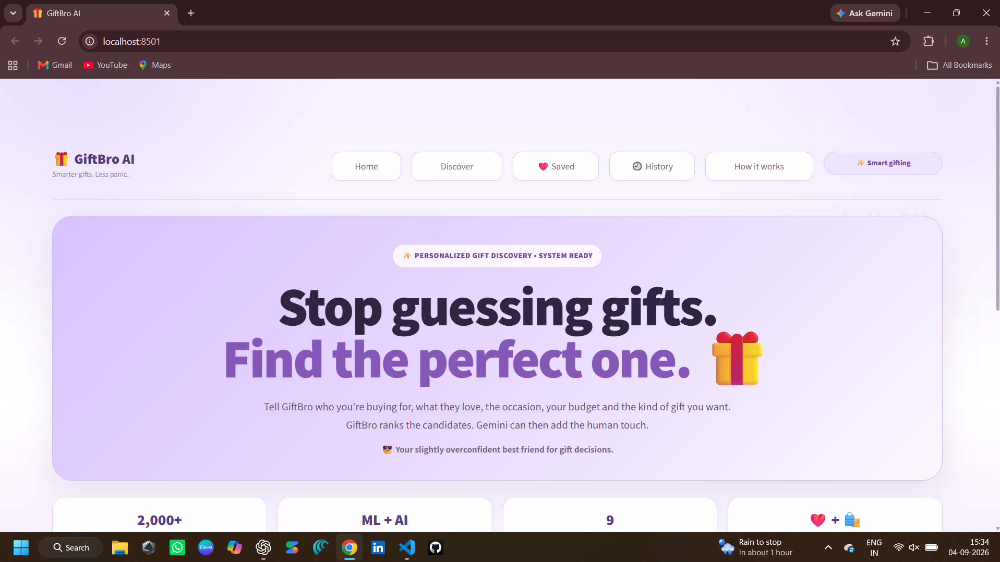
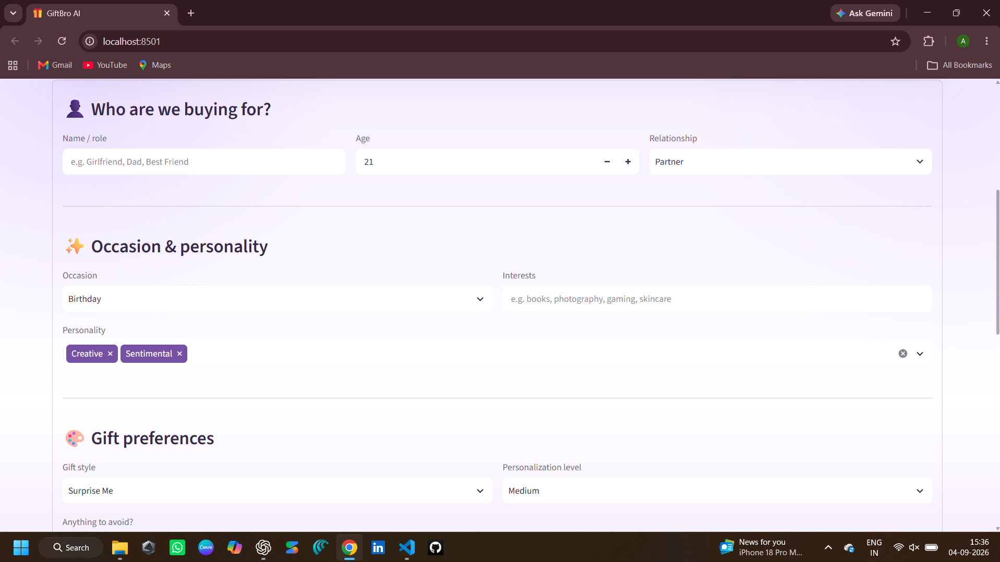
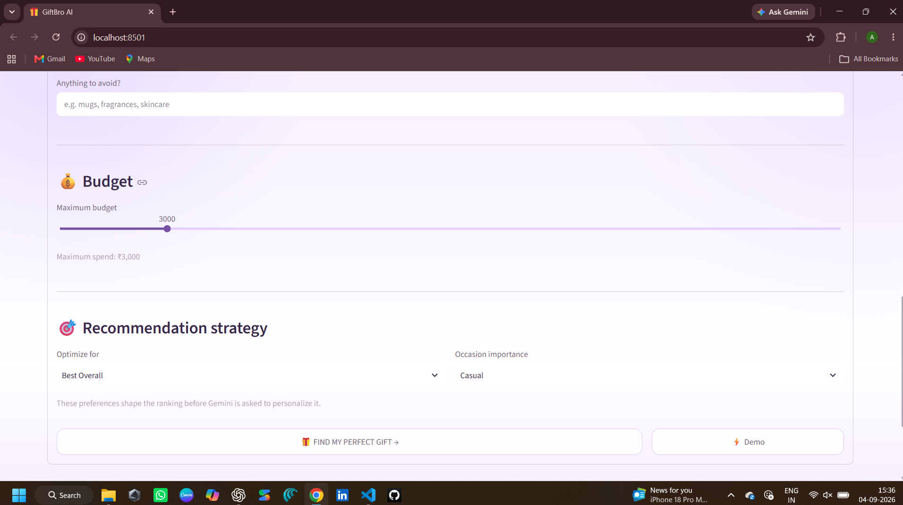
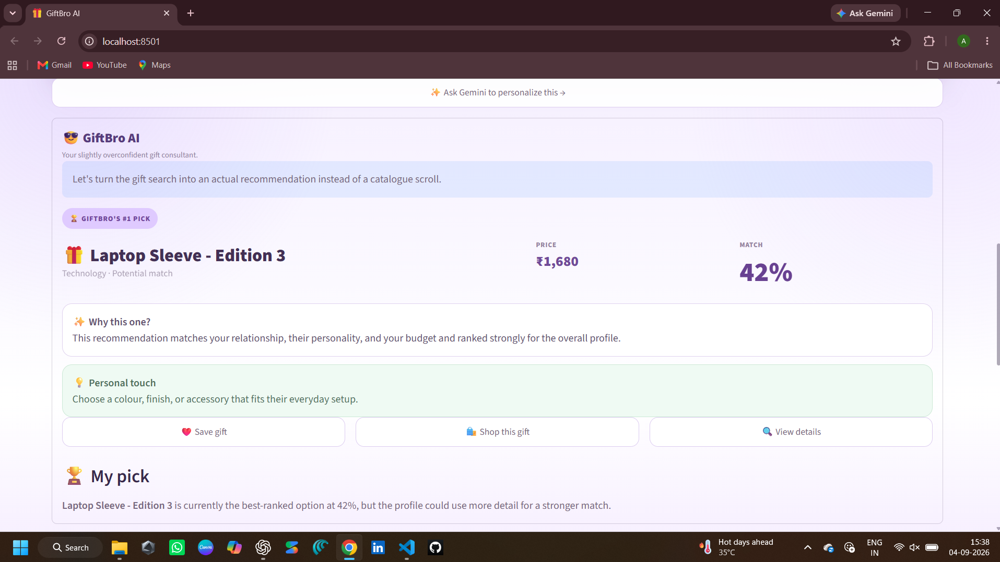
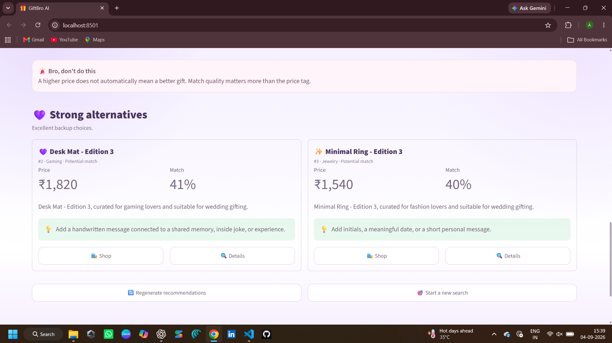
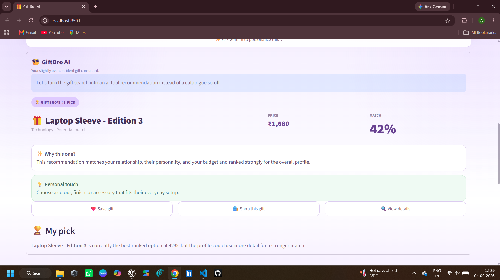

# 🎁 GiftBro AI

**GiftBro AI is a hybrid gift recommendation system that combines machine learning with generative AI to help users find more relevant, personalized gifts.**

Instead of simply asking an AI to invent gift ideas, GiftBro first ranks real catalogue items using a recommendation engine and then optionally uses Gemini to add the human touch.

---

## ✨ What is GiftBro?

Choosing a gift sounds simple until you actually have to choose one.

GiftBro turns that process into a structured recommendation workflow.

The user provides information about the recipient, including:

- Name / role
- Age
- Relationship
- Occasion
- Interests
- Personality
- Gift style
- Personalization level
- Budget
- Things to avoid
- Recommendation strategy

GiftBro then analyzes that profile against its gift catalogue and produces a ranked shortlist.

Gemini can then take that shortlist and generate personalized advice such as:

- Why the gift fits
- How to personalize it
- How to present it
- A message to include
- A final recommendation note

---

# 📸 Product Demo

## 🏠 Home



---

## 🎯 Build a Gift Profile



---

## 🎨 Fine-Tune Preferences



---

## 🧠 Recommendation Results


---

## 🏆 Gift Picks



---

## 🔍 Gift Details



---

## ✨ Gemini Personalization



---

# 🧠 Recommendation Architecture

GiftBro uses a hybrid recommendation pipeline instead of relying on a single score.

```text
                    USER PROFILE
                         │
                         ▼
                Candidate Filtering
                         │
                         ▼
              ┌─────────────────────┐
              │ Recommendation      │
              │      Engine         │
              └─────────────────────┘
                         │
              ┌──────────┴──────────┐
              ▼                     ▼
        TF-IDF Features       Context Signals
              │                     │
              ▼                     ▼
       Cosine Similarity      Occasion Match
                              Relationship Match
                              Interest Match
                              Personality Match
              │                     │
              └──────────┬──────────┘
                         ▼
                   Preference Signals
                         │
                         ▼
                    Budget Fit
                         │
                         ▼
                  Hybrid Ranking
                         │
                         ▼
                Top Gift Candidates
                         │
                         ▼
                 FAST RESULTS
                         │
                         ▼
              Optional Gemini Layer
                         │
                         ▼
             Personalized Gift Advice